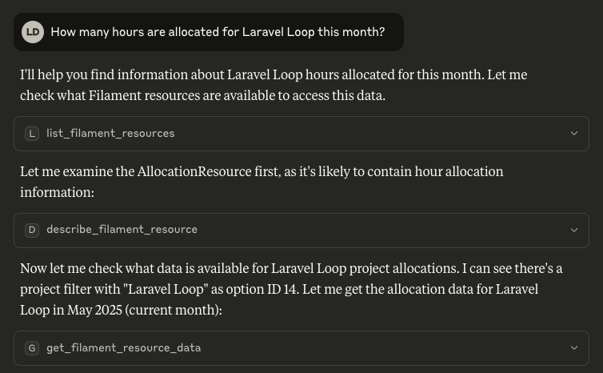

# Laravel Loop


[](LICENSE.md)
[](https://packagist.org/packages/kirschbaum-development/laravel-loop)

Laravel Loop is a powerful Model Context Protocol (MCP) server designed specifically for Laravel applications. It connects your Laravel application with AI assistants using the MCP protocol.

Laravel Loop uses [Prism](https://github.com/prism-php/prism) behind the scenes to build the tools.

> [!IMPORTANT]
> Laravel Loop and its pre-built tools are still in development and this is a beta version.



## What It Does

Laravel Loop allows you to:

- Create and expose your own tools directly integrated with your Laravel application
- Connect with MCP clients like Claude Code, Cursor, Windsurf, and more

**Pre-built tools:**

* [Filament MCP Server](https://github.com/kirschbaum-development/laravel-loop-filament).
* Laravel Model Tools (Interact with your models data): `Kirschbaum\Loop\Toolkits\LaravelModelToolkit` (Write operations to come)
* Laravel Factories Tools (Create test data from your MCP Client): `Kirschbaum\Loop\Toolkits\LaravelFactoriesToolkit`
* Stripe Tool (Interact with the Stripe API): `Kirschbaum\Loop\Tools\StripeTool`

## Installation

You can install the package via composer:

```bash
composer require kirschbaum-development/laravel-loop
```

Publish the configuration file:

```bash
php artisan vendor:publish --tag="loop-config"
```

## Usage

First, you must register your tools (If you don't know where to put, put in `app/Providers/AppServiceProvider`).

```php
use Illuminate\Support\ServiceProvider;
use Kirschbaum\Loop\Facades\Loop;
use Kirschbaum\Loop\Toolkits;
use Kirschbaum\Loop\Tools;

Loop::toolkit(Kirschbaum\Loop\Filament\FilamentToolkit::make());
```

### Custom Tools

To build your own tools, you can use the `Loop::tool` method.

```php
use Kirschbaum\Loop\Facades\Loop;
use Kirschbaum\Loop\Tools\CustomTool;

Loop::tool(
    CustomTool::make(
        name: 'custom_tool',
        description: 'This is a custom tool',
    )
        ->withStringParameter(name: 'name', description: 'The name of the user', required: true)
        ->withNumberParameter(name: 'age', description: 'The age of the user')
        ->using(function (string $name, ?int $age = null) {
            return sprintf('Hello, %s! You are %d years old.', $name, $age ?? 'unknown');
        }),
    );
);
```

The available parameters types can be found in the [Prism Tool Documentation](https://prismphp.com/core-concepts/tools-function-calling.html#parameter-definition).

### Custom Tool Objects

You can also build your own tool classes. Each tool must implement the `Tool` contract, and return a `Prism\Prism\Tool` instance in the `build` method.

```php
use Kirschbaum\Loop\Contracts\Tool;

class HelloTool implements Tool
{
    use \Kirschbaum\Loop\Concerns\Makeable;

    public function build(): \Prism\Prism\Tool
    {
        return app(\Prism\Prism\Tool::class)
            ->as($this->getName())
            ->for('Says hello to the user')
            ->withStringParameter('name', 'The name of the user to say hello to.', required: true)
            ->using(fn (string $name) => "Hello, $name!");
    }

    public function getName(): string
    {
        return 'hello';
    }
}
```

If you want to provide multiple similar tools, you can build a toolkit which returns a collection of tools.

```php
use Kirschbaum\Loop\Collections\ToolCollection;
use Kirschbaum\Loop\Contracts\Toolkit;

class LaravelFactoriesToolkit implements Toolkit
{
    use \Kirschbaum\Loop\Concerns\Makeable;

    public function getTools(): ToolCollection
    {
        return new ToolCollection([
            HelloTool::make(),
            GoodbyeTool::make(),
        ]);
    }
}
```

***

## Connecting to the MCP server

For this to be really useful, you need to connect your MCP client (Claude Code, Claude Desktop, Cursor, Windsurf, etc) to the Laravel LoopMCP server.

The MCP protocol has two main transports to connect: STDIO and Streamable HTTP, and the deprecated HTTP+SSE transport. Laravel Loop supports all of them.

The easiest way to configure your MCP client is to use the `php artisan loop:mcp:config` command. This will guide you through the process of configuring your MCP client.

```bash
php artisan loop:mcp:generate-config
```

### STDIO

To run the MCP server using STDIO, we provide the following artisan command:

```bash
php artisan loop:mcp:start [--user-id=1 [--user-model=] [--auth-guard=] [--debug]
```

To connect Laravel Loop MCP server to Claude Code, for example, you can use the following command:

```bash
claude mcp add laravel-loop-mcp php /your/full/path/to/laravel/artisan loop:mcp:start

# with an authenticated user
claude mcp add laravel-loop-mcp php /your/full/path/to/laravel/artisan loop:mcp:start --user-id=1 --user-model=App\Models\User

# with debug mode
claude mcp add laravel-loop-mcp php /your/full/path/to/laravel/artisan loop:mcp:start --debug
```

To configure Laravel Loop in Cursor, Claude or any MCP clients with a JSON config file:

```json
{
  "mcpServers": {
    "laravel-loop-mcp": {
      "command": "php",
      "args": [
        "/your/full/path/to/laravel/artisan",
        "loop:mcp:start",
        "--user-id=1"
      ]
    }
  }
}
```

### Streamable HTTP & SSE

Having to run PHP or Node to run the MCP server can be annoying. To avoid this, you can use the Streamable HTTP or SSE transport, which connects the MCP client directly to your application via HTTP.

Laravel Loop also supports the [streamable HTTP transport](https://modelcontextprotocol.io/specification/2025-03-26/basic/transports) and the deprecated [HTTP+SSE transport](https://modelcontextprotocol.io/specification/2024-11-05/basic/transports#http-with-sse).

> [!IMPORTANT]
> NOTE: The Streamable HTTP transport is new and not yet supported by all MCP clients, while the SSE (supported by most MCP clients) is deprecated.

The following docs are for both transports. Please note you only need to enable one of them.

#### 1. Enable and configure the transport

To enable the Streamable HTTP transport, update your `.env` file:

```bash
# streamable http
LOOP_STREAMABLE_HTTP_ENABLED=true

# sse
LOOP_SSE_ENABLED=true
```

**Note:** When using SSE, the default driver is `file`, which is the simplest and most convenient for local development. However, for production, we recommend using `redis` to avoid issues with file locking. You can change the driver and additional options in the `config/loop.php` file.

This will expose two MCP endpoints:
- `/mcp` that supports the new Streamable HTTP transport.
- `/mcp/sse` that supports the deprecated HTTP+SSE transport.

**Note:** If you are running your application locally with **https**, most clients will fail due to the self-signed certificates. To avoid this, use the STDIO transport or use the **http** protocol locally.

#### 2. Configure authentication (optional)

Be aware that if you are exposing your endpoint publicly, you are exposing your data to the world. To ensure your MCP endpoints are secure, make sure to configure the `streamable_http.middleware` or `sse.middleware` config options. We recommend using something like Sanctum (configured by default) to protected the endpoint.

```php
[
    'streamable_http' => [
        'middleware' => ['auth:sanctum'],
    ],
    
    'sse' => [
        'middleware' => ['auth:sanctum'],
    ],
]
```

#### 3. Add the MCP server to your client

Then, you just need to configure the MCP server endpoint in your client:

**Claude Code**

```bash
claude mcp add laravel-loop-mcp http://your-url.test/mcp/sse -t sse
```

**From JSON config file**

```json
{
  "mcpServers": {
    "laravel-loop-mcp": {
      "url": "http://your-url.test/mcp/sse",
    }
  }
}
```

Please note that not all clients support direct SSE connections. For those situations, you can proxy it through the `mcp-remote` package. This requires you to have Node.js (> 20) installed. Below an example using the [mcp-remote](https://github.com/geelen/mcp-remote) package.

```json
{
  "mcpServers": {
    "laravel-loop-mcp": {
      "command": "npx",
      "args": [
        "mcp-remote",
        "https://your-remote-url.com/mcp",
        "--header",
        "Authorization: Bearer ${AUTH_TOKEN}"
      ]
    }
  }
}
```

***

## Troubleshooting

**Connection failed: MCP error -32000: Connection closed**

If you get this error, it likely means there's some error happening in your application. Check your applicationlogs for more details.

**Error: spawn php ENOENT**

This can happen when your "php" binary is not in the PATH. This can be solved in a few ways:

- Add the path to your `.bashrc` or `.zshrc` file. Sometimes it can be only in the `.zshrc` file but applications like Claude use `.bashrc`.
- Use the full path of the PHP binary. You can get it by running `which php` in your terminal.
    * This can be a good option to ensure you always use the proper version of PHP for a given project. If you use Herd, for example, your `php` will change depending on the selected version.

**Make sure to check your application logs**

If you are getting an unkown error, check your application logs for more details.

***

## Roadmap

- [ ] Add a chat component to the package, so you can use the tools inside the application without an MCP client.
- [ ] Refine the existing tools
- [ ] Add write capabilities to the existing tools

## Security

If you discover any security related issues, please email security@kirschbaumdevelopment.com instead of using the issue tracker.

## Sponsorship

Development of this package is sponsored by Kirschbaum Development Group, a developer driven company focused on problem solving, team building, and community. Learn more [about us](https://kirschbaumdevelopment.com?utm_source=github) or [join us](https://careers.kirschbaumdevelopment.com?utm_source=github)!

## License

The MIT License (MIT). Please see [License File](LICENSE) for more information.
